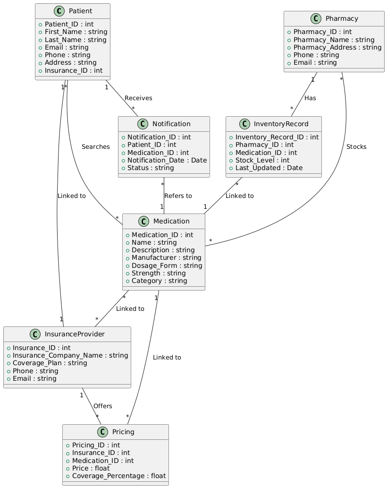

# PharmaConnect 
# Phase 2: Business Process Modeling (Related to Management Information Systems - MIS)
## 1. Define Scope:
The business process being modeled in the PharmaConnect system is the medication search and inventory management process that connects patients and pharmacies through a unified platform. This process addresses the challenges of timely medication access and efficient pharmacy inventory management, aligning with Management Information Systems (MIS) principles by ensuring real-time, data-driven decision-making that optimizes patient experience and pharmacy operations.
### •	Objectives:
 - o	To improve medication accessibility for patients by enabling them to search for available medications at local pharmacies.
 - o	To optimize inventory management for pharmacies, ensuring real-time updates of stock levels and accurate availability data.
 - o	To provide cost transparency by integrating insurance providers to offer pricing based on patients’ insurance coverage.
### •	Expected Outcomes:
 - o	Patients can access real-time medication availability, reducing unnecessary trips to pharmacies and increasing convenience.
 - o	Pharmacies achieve improved inventory management, reducing overstocking and stockouts.
 - o	Enhanced patient satisfaction, as they are notified about medication availability and costs.
## 2. Identify Key Entities:
 The key entities involved in the business process are:
### •	Patient:
 - o	Role: Searches for medications, places orders, receives notifications about medication availability, and is linked to insurance providers.
### •	Pharmacy:
 - o	Role: Updates inventory, stocks medications, and provides real-time information about stock availability. It is also linked to insurance providers for pricing adjustments.
### •	Medication:
 - o	Role: The medication being searched for and stocked by pharmacies. The system tracks its availability and pricing across various pharmacies.
### •	Inventory Record:
 - o	Role: Represents the stock information of a specific medication at a particular pharmacy. It links medications to pharmacies and provides real-time data.
### •	Insurance Provider:
 - o	Role: Provides pricing adjustments for medications, which is integrated with pharmacies and patients to ensure cost transparency.
## 3.  Swimlanes:
Swimlanes can be used to visually separate the different entities involved in the process and clarify responsibilities. Below is an outline of the swimlane structure:
### •	Swimlane 1: Patient
 - o	Searches for medication
 - o	Receives notifications
 - o	Orders medication from pharmacies
### •	Swimlane 2: Pharmacy
 - o	Updates inventory in real-time
 - o	Stocks medications
 - o	Provides availability data to patients
 - o	Links inventory records to insurance providers
### •	Swimlane 3: Insurance Provider
 - o	Offers pricing adjustments for medications
 - o	Links to pharmacies and patients

# 4. Apply UML (Class Diagram)
Below is the UML Class Diagram for the PharmaConnect system.

  

The diagram shows the relationships between key entities in the PharmaConnect system, including Patients, Pharmacies, Medications, and Inventory Records.
